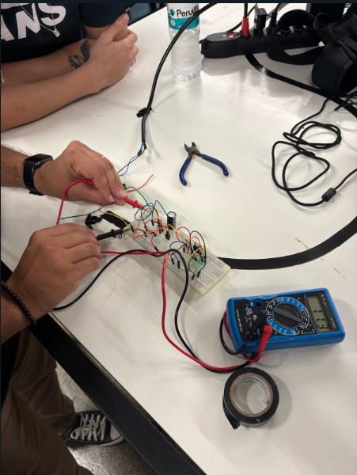

# README - Retificador de Onda Completa com Regulador 7805 ###

## Introdução

Este projeto consiste em um circuito retificador de onda completa com regulador de tensão 7805. O objetivo é converter uma entrada de corrente alternada (AC) em uma saída de corrente contínua (DC) estável de 5V, que pode ser usada para alimentar circuitos eletrônicos de baixa potência.

## Componentes Utilizados

J2 - Conector de entrada de tensão AC
BR1 - Ponte retificadora (Diodos)
C1 - Capacitor eletrolítico de 1µF
C2, C3 - Capacitores cerâmicos de 22nF
U1 - Regulador de tensão 7805
R1 - Resistor de 220Ω
D1 - LED indicador
J1 - Conector de saída de tensão regulada

## Funcionamento do Circuito

1. Entrada de Energia (J2)
A entrada J2 recebe a tensão alternada que será convertida em tensão contínua.
2. Retificação (BR1)
A ponte retificadora (BR1) converte a tensão alternada em tensão pulsante unidirecional, permitindo que a corrente flua sempre no mesmo sentido.
3. Filtragem (C1)
O capacitor eletrolítico C1 reduz as oscilações da tensão pulsante, suavizando a tensão de saída.
4. Regulação de Tensão (U1 - 7805)
O regulador de tensão 7805 estabiliza a tensão de saída em 5V, independentemente de variações na entrada.
5. Filtragem Adicional (C2, C3)
Os capacitores C2 e C3 ajudam a reduzir ruídos e estabilizar ainda mais a tensão de saída.
6. Indicação de Operação (R1 e D1)
O resistor R1 limita a corrente para o LED D1, que serve como indicador de funcionamento do circuito.
7. Saída Regulada (J1)
O conector J1 fornece a tensão DC regulada de 5V para alimentar dispositivos eletrônicos.

# Como Montar o Circuito
Monte a ponte retificadora conectando os diodos corretamente para garantir a retificação da tensão AC.

Adicione o capacitor C1 na saída da ponte retificadora para suavizar a tensão DC.

Conecte o regulador 7805 garantindo que suas conexões (VI, GND, VO) estejam corretas.

Acrescente os capacitores C2 e C3 na entrada e saída do regulador para melhorar a estabilidade.

Instale o resistor R1 e o LED D1 para indicar que o circuito está funcionando.

Conecte os terminais J1 para obter a saída regulada de 5V.

-----------------------------------------------------------------------------------------------------------------------------------------------
-----------------------------------------------------------------------------------------------------------------------------------------------

-----------------------------------------------------------------------------------------------------------------------------------------------
-----------------------------------------------------------------------------------------------------------------------------------------------
# PCB

# Introdução

Este documento descreve a placa de circuito impresso (PCB) projetada para o retificador de onda completa com regulador de tensão 7805. A PCB facilita a montagem e organização dos componentes, garantindo um funcionamento mais confiável e seguro do circuito.

## Dimensões da PCB

Largura: 50 mm
Altura: 30 mm

## Componentes na PCB

J2 - Conector de entrada de tensão AC
BR1 - Ponte retificadora (Diodos)
C1 - Capacitor eletrolítico de 1µF
C2, C3 - Capacitores cerâmicos de 22nF
U1 - Regulador de tensão 7805
R1 - Resistor de 220Ω
D1 - LED indicador
J1 - Conector de saída de tensão regulada

## Layout do Circuito

1. Conexões de Entrada (J2)
A entrada J2 recebe a tensão alternada que será convertida em tensão contínua.
2. Ponte Retificadora (BR1)
A ponte retificadora converte a tensão alternada em uma tensão pulsante contínua.
3. Capacitor de Filtragem (C1)
O capacitor C1 suaviza as oscilações na saída da ponte retificadora.
4. Regulador de Tensão (U1 - 7805)
O regulador 7805 estabiliza a tensão de saída em 5V.
5. Capacitores de Estabilização (C2, C3)
Os capacitores C2 e C3 ajudam a reduzir ruídos e melhorar a estabilidade da tensão regulada.
6. LED Indicador e Resistor (D1 e R1)
O LED D1 indica que o circuito está funcionando, enquanto R1 limita sua corrente.
7. Saída Regulada (J1)
O conector J1 fornece a saída de 5V DC estabilizada.

## Instruções de Montagem

Fixe a ponte retificadora BR1 na posição indicada.
Solde o capacitor C1 para filtrar a tensão.
Monte o regulador 7805 (U1) certificando-se de que os terminais estão corretamente posicionados.
Adicione os capacitores C2 e C3 para melhorar a filtragem.
Solde o resistor R1 e o LED D1 para a indicação de funcionamento.
Conecte os terminais J1 e J2 para a entrada e saída do circuito.

